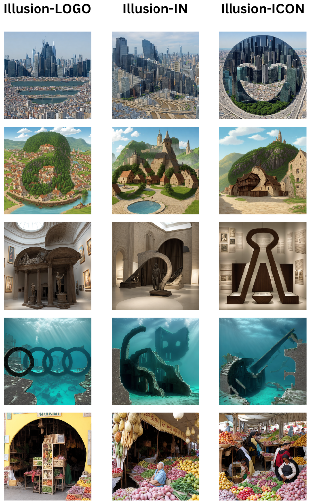
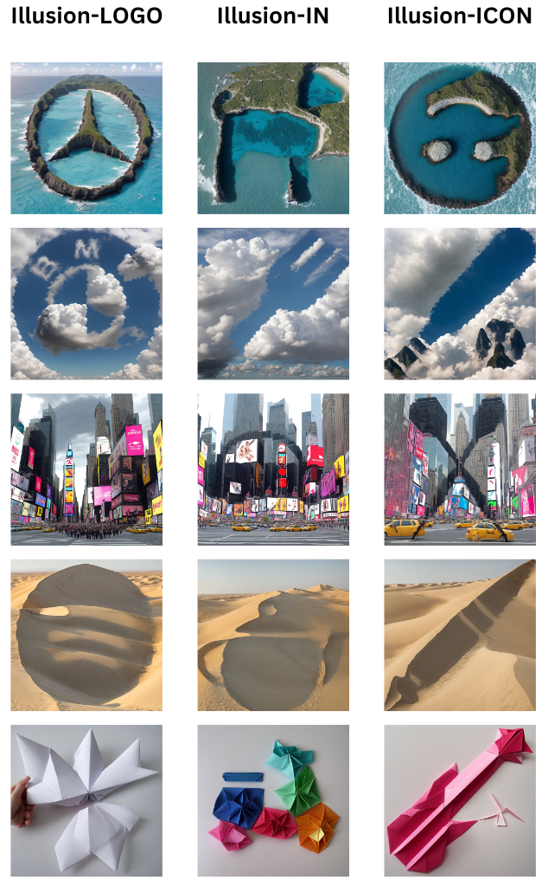
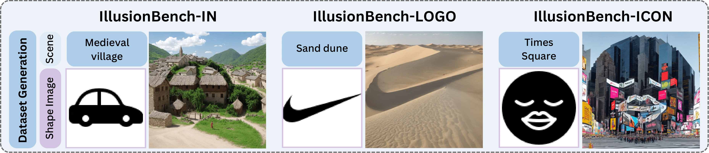
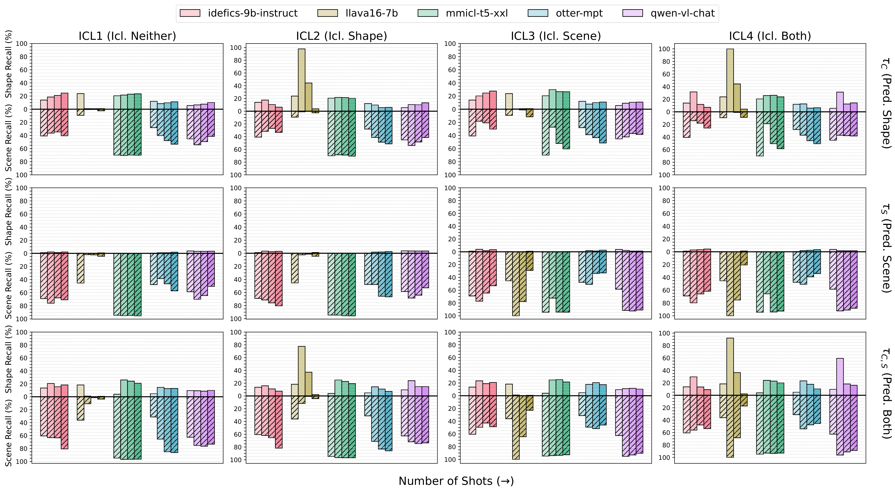

<p>
<h2 align="center"> Hidden in Plain Sight: Evaluating Abstract Shape Recognition in Vision-Language Models</a></h2>

<h5 align="center"> If you like our project, please give us a star ⭐ on GitHub for the latest update.  </h2>


[](https://huggingface.co/datasets/arshiahemmat/IllusionBench)
[](https://arxiv.org/) 


### 🔎 Data Generation overview
<p align="center">

</p>


### 📝 Dataset Samples

<div class="image-container">
  
  
</div>


### 🔥 Zero-shot Evaluation performance on the different cutting-edge models
<p align="center">

</p>

### 🔥 In-context learning Evaluation performance on the different cutting-edge models
<p align="center">

</p>


## ✏️ Citation
If you find our paper and code useful in your research, please consider giving a star :star: and a citation :pencil:.

```BibTeX
@article{
}
```
